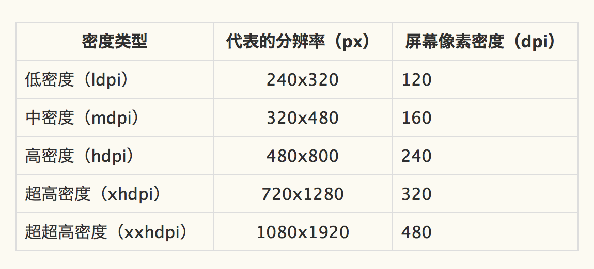
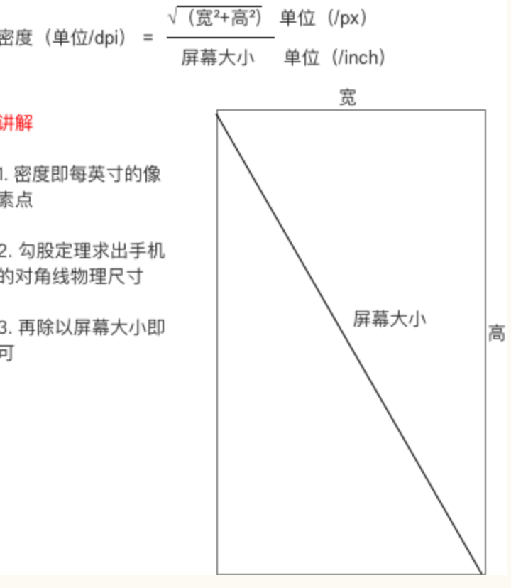
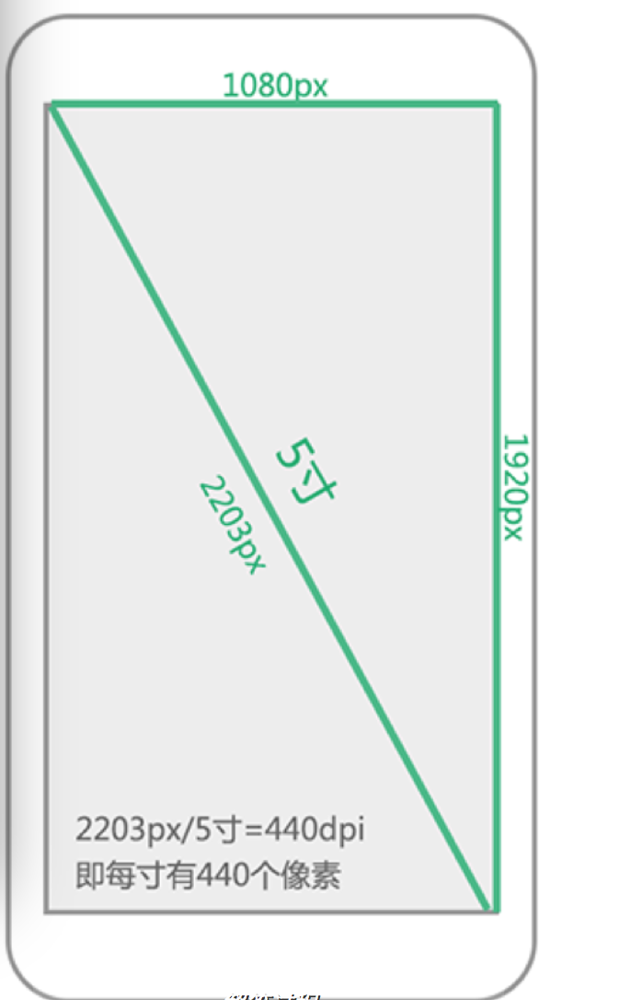
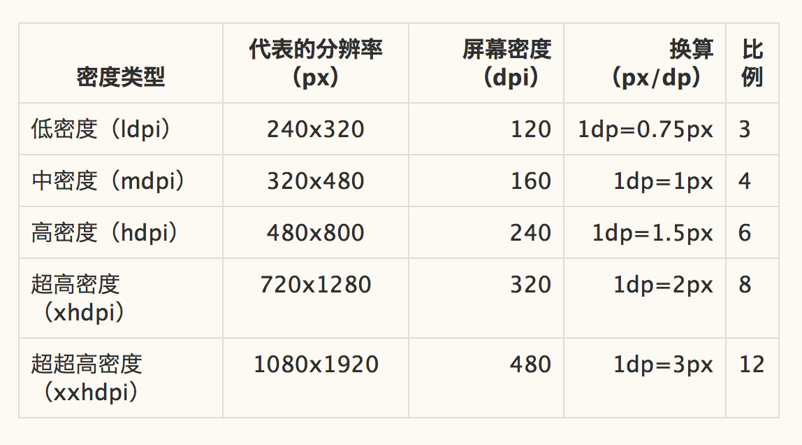
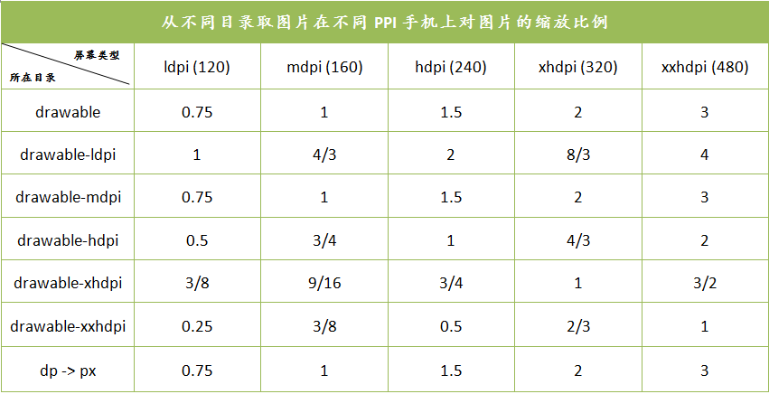
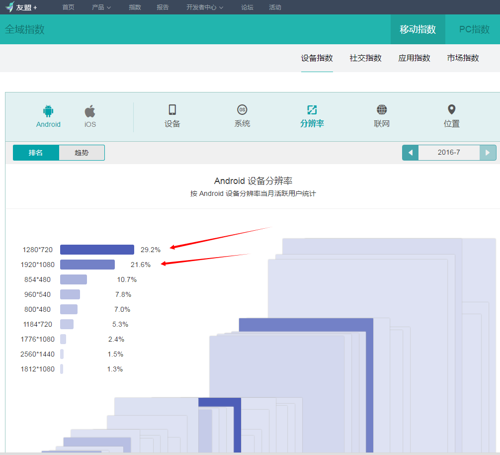

# Android分辨率适配及UI切图规范

## 前言
此规范目的在于，帮助UI设计师们站在开发人员的角度，尽可能的在不影响图片显示效果的情况下，将切图大小控制在最小的情况。最终一起努力将我们的app大小控制在最小的情况。
        
## 1.  相关重要概念
### 1.1  屏幕尺寸
#### 1.1.1 含义
手机对角线的物理尺寸

#### 1.1.2 单位
英寸（inch），1英寸=2.54cm。
Android手机常见的尺寸有5寸、5.5寸、6寸等等

### 1.2  屏幕分辨率
#### 1.2.1 含义
手机在横向、纵向上的像素点数总和。
一般描述成屏幕的”宽x高”=AxB。
含义：屏幕在横向方向（宽度）上有A个像素点，在纵向方向 （高）有B个像素点。
例子：1080x1920，即宽度方向上有1080个像素点，在高度方向上有1920个像素点。

#### 1.2.2 单位
px（pixel），1px=1像素点。

#### 1.2.3  常见分辨率
Android手机常见的分辨率：320x480、480x800、720x1280、1080x1920。

### 1.3  屏幕像素密度
#### 1.3.1 含义
每英寸的像素点数。

#### 1.3.2 单位
dpi（dots per inch）或者ppi（pixels per inch）。
假设设备内每英寸有160个像素，那么该设备的屏幕像素密度=160dpi ：

#### 1.3.3 计算公式
一部手机的分辨率是宽x高，屏幕大小是以寸为单位，那么三者的关系是：

数学不太差的人应该能懂…..吧？
不懂没关系，在这里举个例子：
假设一部手机的分辨率是1080x1920（px），屏幕大小是5寸，问密度是多少？
解：请直接套公式

### 1.4  密度无关像素
#### 1.4.1 含义
density-independent pixel，叫dp或dip，与终端上的实际物理像素点无关。

#### 1.4.2 单位
dp，可以保证在不同屏幕像素密度的设备上显示相同的效果。
Android开发时用dp而不是px单位设置图片大小，是Android特有的单位。
场景：假如同样都是画一条长度是屏幕一半的线，如果使用px作为计量单位，那么在480x800分辨率手机上设置应为240px；在320x480的手机上应设置为160px，二者设置就不同了；如果使用dp为单位，在这两种分辨率下，160dp都显示为屏幕一半的长度。

#### 1.4.3 单位转换
dp与px的转换，公式为：dp*dpi/160=px, dp = px*160/dpi。
因为ui设计师给你的设计图是以px为单位的，Android开发则是使用dp作为单位的，那么我们需要进行转换：

在Android中，规定以160dpi（即屏幕分辨率为320x480）为基准：1dp=1px。

### 1.5  独立比例像素
#### 1.5.1 含义
scale-independent pixel，叫sp或sip。

#### 1.5.2 单位
sp
Android开发时用此单位设置文字大小，可根据字体大小首选项进行缩放。
推荐使用12sp、14sp、18sp、22sp作为字体设置的大小，不推荐使用奇数和小数，容易造成精度的丢失问题；小于12sp的字体会太小导致用户看不清。

|    默认的界面风格      |     480*800，PPI = 240     |     720*1280，PPI = 320      |
|       -----------      |     ------------------     |      ---------------         |
|    Text Size Micro     |     18px = 12sp            |      24px = 12sp             |
|    Text Size Small     |     21px = 14sp            |     28px = 14sp              |
|                        |                            |     32px = 16sp              |
|    Text Size Medium    |     27px = 18sp            |     36px = 18sp              |
|    Text Size Large     |     33px = 22sp            |     44px = 22sp              |

## 2. 一套资源图适配理论分析
### 2.1 Android图片选择策略
Android系统提供了这么多不同密度的目录，那么最终图片的使用到底是按照什么规则来使用的呢？
策略如下：
1. 到屏幕密度对应的目录去找，如果找到就拿来用。
2. 如果没找到，就去比这个密度高一级的目录里面去找，如果找到就拿来用。
3. 如果没找到就继续往上找，以此类推。
4. 如果到最高密度目录还没有找到的话，就会去比自身屏幕密度低一级的目录去找，找到了就拿来用。
5. 如果没找到， 就去更低密度目录找，以此类推。
6. 如果到最低密度目录都还没找到的话，图片无法显示（不过一般不会出现这种现象，因为如果每个目录都没有这个图片的话，你是编译不过的）。

这里有两点需要注意：
1. 首先会去比自己密度高的目录里去找，这是因为系统相信，你在密度更高的目录里会放置分辨率更大的图片，这样的话这个图片会被缩小，但同时显示效果不会有损失，但是如果优先去低一级别的目录去找的话，找到的图片就会被放大，这样的话这个图片就会被拉扯模糊了。
2. 如果在mdpi里找不到是不会直接去ldpi里找的，而是先去默认的drawble目录里找，这是因为drawble目录和drawble-mdpi是一个级别的。

### 2.2 Android系统对图片缩放规则
上文中提到如果在手机对应的目录没有找到图片，就会按照一定的策略去其他目录找，那找到了以后就原图显示么？ **非也。**          
对于放在不同目录下的图片， 系统会按照一定比例对原始的图片进行放大或者缩小，具体的放大缩小比例可参考下表，图片所在目录和对应的屏幕密度是相同时图片缩放比例为1，也就是原图显示，而横向的比例表示分别放在该密度手机上运行时图片被缩放的比例。

对原始图片的缩放倍数。          

## 3. 具体适配方案
有了以上理论分析的支持，总结下来：可以通过一套资源图来适配所有的分辨率。那么这套资源图该如何选择呢 ？          
先上一张出自友盟统计的数据图：      

