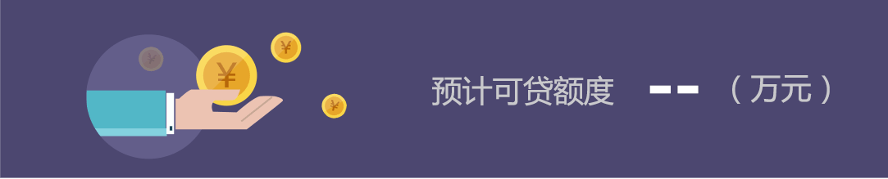
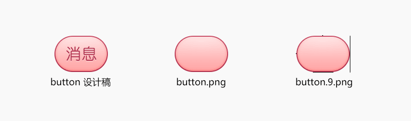

# Android分辨率适配及UI切图规范

## 前言
此规范目的在于，帮助UI设计师们站在开发人员的角度，尽可能的在不影响图片显示效果的情况下，将切图大小控制在最小的情况。最终一起努力将我们的app大小控制在最小的情况。
        
## 1.  相关重要概念
### 1.1  屏幕尺寸
#### 1.1.1 含义
手机对角线的物理尺寸

#### 1.1.2 单位
英寸（inch），1英寸=2.54cm。
Android手机常见的尺寸有5寸、5.5寸、6寸等等

### 1.2  屏幕分辨率
#### 1.2.1 含义
手机在横向、纵向上的像素点数总和。
一般描述成屏幕的”宽x高”=AxB。
含义：屏幕在横向方向（宽度）上有A个像素点，在纵向方向 （高）有B个像素点。
例子：1080x1920，即宽度方向上有1080个像素点，在高度方向上有1920个像素点。

#### 1.2.2 单位
px（pixel），1px=1像素点。

#### 1.2.3  常见分辨率
Android手机常见的分辨率：320x480、480x800、720x1280、1080x1920。

### 1.3  屏幕像素密度
#### 1.3.1 含义
每英寸的像素点数。

#### 1.3.2 单位
dpi（dots per inch）或者ppi（pixels per inch）。
假设设备内每英寸有160个像素，那么该设备的屏幕像素密度=160dpi ：


#### 1.3.3 计算公式
一部手机的分辨率是宽x高，屏幕大小是以寸为单位，那么三者的关系是：


数学不太差的人应该能懂…..吧？
不懂没关系，在这里举个例子：
假设一部手机的分辨率是1080x1920（px），屏幕大小是5寸，问密度是多少？
解：请直接套公式


### 1.4  密度无关像素
#### 1.4.1 含义
density-independent pixel，叫dp或dip，与终端上的实际物理像素点无关。

#### 1.4.2 单位
dp，可以保证在不同屏幕像素密度的设备上显示相同的效果。
Android开发时用dp而不是px单位设置图片大小，是Android特有的单位。
场景：假如同样都是画一条长度是屏幕一半的线，如果使用px作为计量单位，那么在480x800分辨率手机上设置应为240px；在320x480的手机上应设置为160px，二者设置就不同了；如果使用dp为单位，在这两种分辨率下，160dp都显示为屏幕一半的长度。

#### 1.4.3 单位转换
dp与px的转换，公式为：dp*dpi/160=px, dp = px*160/dpi。
因为ui设计师给你的设计图是以px为单位的，Android开发则是使用dp作为单位的，那么我们需要进行转换：


在Android中，规定以160dpi（即屏幕分辨率为320x480）为基准：1dp=1px。

### 1.5  独立比例像素
#### 1.5.1 含义
scale-independent pixel，叫sp或sip。

#### 1.5.2 单位
sp
Android开发时用此单位设置文字大小，可根据字体大小首选项进行缩放。
推荐使用12sp、14sp、18sp、22sp作为字体设置的大小，不推荐使用奇数和小数，容易造成精度的丢失问题；小于12sp的字体会太小导致用户看不清。

|    默认的界面风格      |     480*800，PPI = 240     |     720*1280，PPI = 320      |
|       -----------      |     ------------------     |      ---------------         |
|    Text Size Micro     |     18px = 12sp            |      24px = 12sp             |
|    Text Size Small     |     21px = 14sp            |     28px = 14sp              |
|                        |                            |     32px = 16sp              |
|    Text Size Medium    |     27px = 18sp            |     36px = 18sp              |
|    Text Size Large     |     33px = 22sp            |     44px = 22sp              |


## 2. 一套资源图适配理论分析
### 2.1 Android图片选择策略
Android系统提供了这么多不同密度的目录，那么最终图片的使用到底是按照什么规则来使用的呢？                
策略如下：                     
1. 到屏幕密度对应的目录去找，如果找到就拿来用。               
2. 如果没找到，就去比这个密度高一级的目录里面去找，如果找到就拿来用。                           
3. 如果没找到就继续往上找，以此类推。                 
4. 如果到最高密度目录还没有找到的话，就会去比自身屏幕密度低一级的目录去找，找到了就拿来用。              
5. 如果没找到， 就去更低密度目录找，以此类推。            
6. 如果到最低密度目录都还没找到的话，图片无法显示（不过一般不会出现这种现象，因为如果每个目录都没有这个图片的话，你是编译不过的）。          

这里有两点需要注意：           
1. 首先会去比自己密度高的目录里去找，这是因为系统相信，你在密度更高的目录里会放置分辨率更大的图片，这样的话这个图片会被缩小，但同时显示效果不会有损失，但是如果优先去低一级别的目录去找的话，找到的图片就会被放大，这样的话这个图片就会被拉扯模糊了。               
2. 如果在mdpi里找不到是不会直接去ldpi里找的，而是先去默认的drawble目录里找，这是因为drawble目录和drawble-mdpi是一个级别的。

### 2.2 Android系统对图片缩放规则
上文中提到如果在手机对应的目录没有找到图片，就会按照一定的策略去其他目录找，那找到了以后就原图显示么？ **非也。**          
对于放在不同目录下的图片， 系统会按照一定比例对原始的图片进行放大或者缩小，具体的放大缩小比例可参考下表，图片所在目录和对应的屏幕密度是相同时图片缩放比例为1，也就是原图显示，而横向的比例表示分别放在该密度手机上运行时图片被缩放的比例。

对原始图片的缩放倍数。          


## 3. 具体适配方案
### 3.1 最终密度资源目录的选择
有了以上理论分析的支持，总结下来：可以通过一套资源图来适配所有的分辨率。那么这套资源图该如何选择呢 ？          
先上一张出自友盟统计的数据图：      


图中数据显示，截至2016年7月份，720p和1080p的手机设备占据了50%以上。从数据上看720p的手机设备仍是当下的主流。因此建议是UI根据1280X720的分辨率出具设计稿，以及选择使用最终的切图，将720p的切图放在xhdpi密度目录下。

### 3.2 可能出现的问题及处理方案
**1. 在低分辨率且内存极低的设备运行，加载图片资源出现OOM问题**
原因很简单：因为我们只留下了xhdpi资源目录，低分辨率手机使用的自然也是这个目录下的资源图片。    
假如现在有1张720*1280分辨率的背景图，低分辨率设备在自身内存已经比较低的情况下，去加载这张大分辨率的图片时，就有很大几率会出现OOM问题。             
解决方案：        
1. 尽量少的使用这种满屏分辨率的切图。
2. 实在避免不了（诸如欢迎界面），则选择在hdpi或者mdpi目录下，存放相应的背景切图。  

**2. 在非常规比例的屏幕尺寸下，UI显示效果不一致**
全球已经有近3万种Android机型设备，可见Android设备的碎片化问题是多么严重。自然而然会存在很多比较特殊尺寸的机型设备，这个时候，最容易出现的问题就是UI显示效果与设计图不一致。        
解决方案：       
1. 非常特殊的分辨率，可能需要单独进行切图。
2. 利用Android提供的限定符，设计不同尺寸适配目录。提供多套dimens尺寸。    


## 4. 切图规范
### 4.1 规则或者有一定规律的图片，都采用.9.png格式切图。
举例：      


这张图其实是很有规律的上下渐变的图片，所以可以采用.9.png格式来切图。而并不需要切一整张的矩形图。           
另外，已经作为.9.png格式的切图，则可以尽量按最小尺寸来切，例如：  


此9图只是给出了1个像素点的可拉伸区域，则其余有很大一部分图已经是无意义的了，并不需要切这么大尺寸的图。

### 4.2 纯色的背景之类的不需要切图，只要提供颜色色值给到开发。
举例：       


这是一张纯色图，其实没有必要提供切图，只需要提供给研发人员色值就可以了。

### 4.3 不带alpha通道的图片使用jpg格式。
举例：      


### 4.4 只有细微差别的2张及以上的图片，可以将细微差别的图片剥离出来切。
举例：         


这2张图的细微差别其实只是右下角的选择状体的图片，然而却提供了2张大的切图，右下角的选择状态图片和背景图是一体的，其实只需要提供一张背景图，选择状态的图片分开切。（当然，这种切图的时候，需要提前和开发人员进行沟通。）

### 4.5 当整张大图只有小部分图片存在实际意义的时候，只需要提供实际意义的那部分切图。

### 4.6 能够利用代码实现的效果则不需要资源图
* 使用shape制作背景图：          

  	很多背景图（纯色背景、带边框、圆角）都可以用shape来制作，这样仅用xml代码就能代替png资源。

	举例：

	```
	<?xml version="1.0" encoding="utf-8"?>
	<shape xmlns:android="http://schemas.android.com/apk/res/android">
		<solid android:color="@color/white" />
		<corners android:radius="10dp" />
		<stroke android:color="@color/default_page_background_color"
				android:width="2px" />
	</shape>
	```
* 用RotateDrawable代替仅仅是方向不同的“内容相同”的图片  

	这里两个图片是两个按钮箭头，但是仅仅方向不同而已，其实可以只用其中一个图片即可，而另一个用RotateDrawable来让其“调转”180度：      
	

* 用layer-list来制作多层图片从而达到复用,有些需求中需要一种图片，但是明显这个图片是其他几个图片简单叠加而已，那么可以使用layer-list来达到目的

	

## 5. .9.png图片格式详解
在Android的设计过程中，为了适配不同的手机分辨率，图片大多需要拉伸或者压缩，这样就出现了可以任意调整大小的一种图片格式“.9.png”。这种图片是用于Android开发的一种特殊的图片格式，它的好处在于可以用简单的方式把一张图片中哪些区域可以拉伸，哪些区域不可以拉伸设定好，同时可以把显示内容区域的位置标示清楚。             
本文首先看下普通的.png资源与.9.png的资源区别：        


普通的png资源就不多介绍了，可以明显看到.9.png的外围是有一些黑色的线条的，那这些线条是用来做什么的呢？我们来看下放大的图像：  


放大后可以比较明显的看到上下左右分别有一个像素的黑色线段，这里分别标注了序号。简单来说，序号1和2标识了可以拉伸的区域，序号3和4标识了内容区域。当设定了按钮实际应用的宽和高之后，横向会拉伸1区域的像素，纵向会拉伸2区域的像素。如下图：    


拉伸的含义应该比较容易理解，但是内容区域的标注有什么意义呢？我们来看下图：     


这里程序设置的文字垂直居中，水平居左的对齐方式。对齐方式是没有问题的，但是对于这种大圆角同时又有些不规则边框的的图形来说，错误的标注方式会让排版看起来很混乱。所以我们需要修正内容区域的线段位置和长度。   


把横向的内容区域缩短到圆角以内，纵向的内容区域控制在输入框的高度以内，这样文字就可以正常显示了。      

这里还有一种特殊情况，就是本身是.9.png的资源，但是在修改过程中你希望这张.9.png不能被拉伸（在做皮肤的情况中有可能会遇到），那怎么办呢？只要把拉伸区域的点点在透明像素的地方就可以了，这样拉伸的时候会拉伸透明部分的像素，而不会拉伸图像本身。如下图：  


大家可以看到拉伸区域的黑点是可以不连续的。

说了半天.9.png的用法，那.9.png如何输出呢？有很多种方式可以输出.9.png，比如说用draw9patch.bat这个工具，或者简单一点，用photoshop直接输出。输出的方式是先输出普通的png资源，然后扩大画布大小，上下左右各空出一个像素，再用一个像素的铅笔工具（颜色选择纯黑色），上下左右分别画点就可以了，保存的时候注意把后缀修改为.9.png。      
有两点需要特别注意下：            
1.最外围的一圈像素必须要么是纯黑色，要么是透明，一点点的半透明的像素都不可以有，比如说99%的黑色或者是1%的投影都不可以有;               
2.文件的后缀名必须是.9.png，不能是.png或者是.9.png.png，这样的命名都会导致编译失败。

