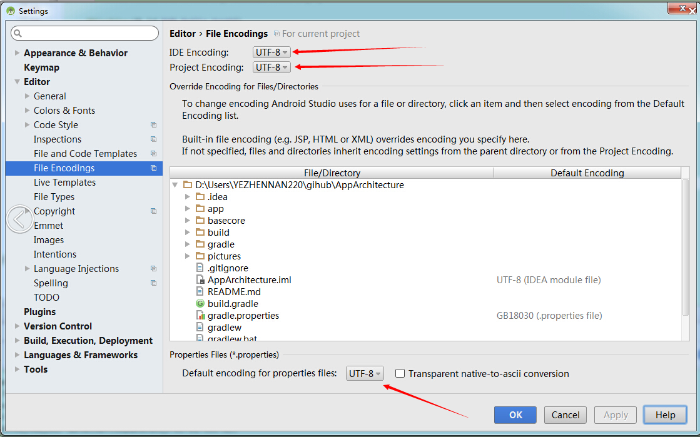

## 目录

+ [简介](#0)
+ [目的](#00)
+ [1. 代码格式规范](#1)
+ [2. 命名规范](#2)
  * [1.1 常量](#2.1)
  * [1.2 变量](#2.2)
  * [1.3 方法](#2.3)
  * [1.4 类](#2.4)
  * [1.5 接口](#2.5)

+ [3. 注释规范](#3)


<h3 id="0"> 简介 </h3>

**简介：** 古人云“无规矩，不成方圆”，小的公司和团队更强调机动灵活，而大的公司和团队就更强调规范，没有一套标准可执行的规范势必在实际的工作过程中造成很多问题，造成沟通成本的增加和资源的浪费。
每个人都有自己的喜欢或者擅长的开发风格特点，所以代码规范其实并不是一成不变的，但是每个团队或者每个公司必须要统一规范，减少沟通成本。

<h3 id="00"> 目的 </h3>
**目的：** 规范！代码的简洁、美观、可读性、复用性、高质量，利用已有的轮子，少去重复造轮子


<h3 id="1"> 1. 代码格式规范 </h3>

(1)编码方式统一用UTF-8。 Android Studio默认已是UTF-8，只要不去改动它就可以了。



(2)代码采用统一格式，可以自己集成一种格式，也可以直接使用Android Studio默认的格式，并且使用快捷键进行代码自动格式化。       
Windows：CTRL+ALT+L            
Mac：OPTION+COMMAND+L                 

<h3 id="2"> 2. 命名规范 </h3>

一切命名以可读性且具有实意为前提，尽量采用英文，对于一些特殊名词，可以使用拼音，或者拼音缩写，如果是缩写，应当加上适当的注释说明。
 
<h4 id="2.1"> 2.1 常量 </h4> 

常量必须用static final修饰，保证其值在运行时不可被改写。所有字母大写，单词之间用下划线“_"分隔。例如

```
// Good
static final int STATE_DOWNLOADING = 0;
static final int STATE_IDLE = 1;
static final int STATE_BLOCKING = 2;
 
// Bad
static final int stateDownloading = 0;
```

方法块内的常量必须用final修饰，并且字母大写，例如

```
public void sortUserList(List<User> userList) {
    // Good
    final int N = userList.size();
 
    // Bad
    final int n = userList.size();

}
```

<h4 id="2.2"> 2.2 变量 </h4> 

格式采用**驼峰命名法**，变量首字母小写，单词以首字母大写分隔。例如：

```
// Good
private String mCityName;
 
// Bad
private String cityname;
private String city_name;
```

不可以以除字母外的任何字符作为开头，不可以使用无意义的描述词汇。例如:

```
// Good
private String mCityName;
 
// Bad
private String _cityName;
private String arg1;
```

私有和被保护成员变量以小写字母m为前缀，静态私有成员变量以小写字母s为前缀，公开成员变量和静态变量都不用以前缀开头。例如:

```
// Good
private String mUsername = "hugo";
protected int mRole;
private static Object sInstance;
 
public int age;
public static Object instance;
 
// Bad
private String user_name = "hugo";
protected int role;
private int _role;
private static Object instance;
 
public int mAge;
public static Object sInstance;
```

方法内的变量都不需要加任何前缀。例如:

```
public void sortUserList(List<User> userList) {
    // Good
    User temp = null;
 
    // Bad
    User _temp = null;
    User mTemp = null;
}
```

<h4 id="2.3"> 2.3 方法 </h4> 

方法名采用**驼峰命名法**，首字母小写，不得使用字母以外的字符，方法描述的是一个操作行为，因此，必须以动词开头。方法名称应当是一个“动词+名词”的动宾结构的词组或者就是一个动词。例如命名一个下载图片的方法:
```
// Good
public void downloadImage(String url) {
    // do something.
}
 
// Bad
// 首字母大写
public void DownloadImage(String url) {
    // do something.
}
// or
// 带有下划线
public void download_image(String url) {
    // do something.
}
// or
// 非动宾结构词组
public void imageLoading(String url) {
    // do something.
}
```

如果是一个判断方法，名称以is、can、has等词开头。例如命名一个判断图片下载器是否正在下载的方法:
```
// Good
public boolean isLoading() {
    return mState == STATE_DOWNLOADING;
}
 
// Bad
public boolean loading() {
    return mState == STATE_DOWNLOADING;
}
```


<h4 id="2.4"> 2.4 类 </h4> 

类名采用**大驼峰命名法**，首字母大写，并且类名必须是一个名词或者名词词组。例如命名一个图片加载器类:
```
// Good
public class ImageLoader {
     
    private int mState = 0;
    ......
}
 
// Bad
// 非名词词组
public class LoadImage {
    ......
}
// or
// 首字母小写
public class imageLoad {
    ......
}
```

如果是抽象类，名称建议以Abs作为前缀。列如命名一个加载器抽象类:
```
// 加载器抽象类
public abstract class AbsLoader {
    ......
}
 
// 图片加载器类
public class ImageLoader extends AbsLoader {
    ......
}
// 文件加载器类
public class FileLoader extends AbsLoader {
    ......
}
```

如果一个类继承自另外一个类，那么这个类名必须以父类的名称作为后缀，例如:
```
public class MainActivity extends Activity {
    ......
}
```

如果父类带有一些特定前缀的，例如Base、Abs等，子类名称应该将这些前缀去掉，例如:
```
// 通常我们的项目中会存在一个自定义的Activity的基类
// 定义了一些公共属性和方法
public class BaseActivity extends Activity {
    ......
}
 
// 子类可以将父类的Base去掉
public class MainActivity extends BaseActivity {
    ......
}
```

<h4 id="2.5"> 2.5 接口 </h4> 


<h3 id="3"> 3. 注释规范 </h3>
