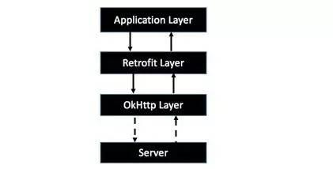

# Retrofit 

## 目录

+ [概述](#0)
+ [使用](#1)
+ [源码解析](#2)
+ [扩展知识](#3)

<h2 id="0"> 概述 </h2>

> [项目官网](http://square.github.io/retrofit/)
>                    [项目源码：github](https://github.com/square/retrofit)

**Retrofit**是一个 [RESTful](http://baike.baidu.com/link?url=diNiB-Mag1_w58m9Ygv1Q_exrnWeIwysrGakOZpcB1gnhiNfqhX-5zUgM6r4lsU2eilk7J7Qcg7EJdXp7K2M8K "RESTful百度百科") 的 HTTP 网络请求框架的**封装**。注意这里并没有说它是`网络请求框架`，主要原因在于网络请求的工作并不是Retrofit来完成的。Retrofit2.0 开始内置`OkHttp`，前者专注于接口的封装，后者专注于网络请求的高效，二者分工协作。

我们的应用程序通过Retrofit请求网络，实际上是使用Retrofit接口层封装请求参数、Header、Url 等信息，之后由OkHttp完成后续的请求操作，在服务端返回数据之后，OkHttp将原始的结果交给Retrofit，后者根据用户的需求对结果进行解析的过程。

<h2 id="1"> 使用 </h2>

<h2 id="2"> 源码解析 </h2>

<h2 id="3"> 扩展知识 </h2>
